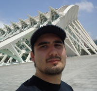



<!-- ## Contact Information -->

	

		

			

				
				<h3>
					
					Emir
					Muñoz
					
					 
					
				</h3>
			

			

				

					
I'm a PhD Student at the National University of Ireland (NUI) Galway and Researcher in the KI2NA project at Fujitsu Ireland Ltd. I started the PhD programme on February 2014.
					Before that I worked as Research Assistant at Digital Enterprise Research Institute (DERI) since October 2012. I am also a Computer Engineer and I hold a Master degree in Computer 
					Engineering from Universidad de Santiago, Chile.

					
My research interests are: Databases, Web Data Mining, and Artificial Intelligence. Currently, focused on quality analysis and anomaly detection in Linked Data.

				

			

		

	

	<ul>
		<li><b>Current Affiliations</b>
		<ul>
			<li>Ph.D. Researcher at <a target="_blank" href="http://www.fujitsu.com/ie/">Fujitsu Ireland Limited</a></li>
			<li>2nd Year Ph.D. Student at <a target="_blank" href="http://www.nuigalway.ie/">National University of Ireland, Galway</a></li>
		</ul>
		</li>
		<li><b>Past Affiliations</b>
		<ul>
			<li><a target="_blank" href="http://www.deri.ie/users/emir-munoz">Research Assistant</a> at <a target="_blank" href="http://www.deri.ie/">Digital Enterprise Research Institute</a> (<a target="_blank" href="http://www.deri.ie/">DERI</a>), Galway, Ireland. <a target="_blank" href="http://urq.deri.ie/">Reasoning and Querying Unit (URQ)</a>.</li>
			<li>Lecturer, <a target="_blank" href="http://www.informatica.usach.cl/">Department of Computer Engineering</a>, <a target="_blank" href="http://www.usach.cl/">University of Santiago de Chile</a></li>
			<li>Lecturer, <a target="_blank" href="http://ucentral.cl/prontus_ucentral2012/site/edic/base/port/fcfm.html">Faculty of Mathematics and Physical Sciences</a>, <a target="_blank" href="http://www.ucentral.cl/prontus_ucentral/site/edic/base/port/inicio.html">Central University of Chile</a></li>
			<li>Research Intern at <a target="_blank" href="http://www.deri.ie/">Digital Enterprise Research Institute</a> (<a target="_blank" href="http://www.deri.ie/">DERI</a>), Galway, Ireland. <a target="_blank" href="http://urq.deri.ie/">Reasoning and Querying Unit (URQ)</a>.</li>
			<li>Project Engineer at <a target="_blank" href="http://labs.yahoo.com/location/santiago/">Yahoo! Research Latin America</a>, in the project Fondef <a target="_blank" href="http://www.conicyt.cl/fondef/2010/11/12/proyecto-fondef-%E2%80%9Cobservatorios-escalables-de-la-web-en-tiempo-real%E2%80%9D/">"Observatorios Escalables de la Web en Tiempo-Real"</a></li>
		</ul>
		</li>
		<li><b>Education</b>
		<ul>
			<li>Master of Computer Engineering, <a target="_blank" href="http://www.informatica.usach.cl/">University of Santiago de Chile</a>, Aug 2009-Apr 2011</li>
			<li>Diploma in Computer Engineering, <a target="_blank" href="http://www.informatica.usach.cl/">University of Santiago de Chile</a>, Apr 2011</li>
			<li>Bachelor of Science in Engineering, <a target="_blank" href="http://www.informatica.usach.cl/">University of Santiago de Chile</a>, Jun 2009</li>
		</ul>
		</li>
		<li><b>Master Thesis</b>
		<ul>
			<li>Emir Muñoz: <a target="_blank" href="publications/files/master-thesis-2011.pdf">XML Keys: Implication and Validation Algorithms Implementation</a>. Advisors: <a target="_blank" href="https://www.scch.at/de/team/person_id/189/field/0/category/0">Flavio Ferrarotti</a> and <a target="_blank" href="http://www.dcc.uchile.cl/%7Emmarin/">Mauricio Marín</a>, University of Santiago de Chile, December 2010 <a href="publications/files/master-thesis-2011-slides.pdf">[slides]</a> <i>(In Spanish)</i></li>
		</ul>
		</li>
		<li><b>Grants, Awards &amp; Fellowships</b>
		<ul>
             <li>Winner of the third <a href="http://knowalod2015.informatik.uni-mannheim.de/en/linkeddataminingchallenge/">Linked Data Mining Challenge</a>, In 4th Workshop on Knowledge Discovery and Data Mining Meets Linked Data - Know@LOD 2015, Portoroz, Slovenia, May 31st, 2015 <a href="publications/files/LDM2015_Challenge_Award.pdf">[certificate]</a></li> NEW
             <li>Winner of the first <a href="http://www.up.co/communities/ireland/galway/blog/friendship-wins-first-galway-startup-weekend-paired-purchasing-service">Galway Startup Weekend</a> with FriendShip It!! project, Galway, Ireland, November 16, 2014 <a href="projects/files/swGalway.pdf">[certificate]</a></li>
			<li>Winner of the first <a href="http://oak.dcs.shef.ac.uk/ld4ie2014/AWARDS.html">LD4IE 2014 Challenge</a> with μRaptor system, In 2nd International Workshop on Linked Data for Information Extraction - LD4IE 2014, Riva del Garda, Italy, October 20th, 2014 <a href="publications/files/LD4IE2014_Challenge_Award.pdf">[certificate]</a></li>
			<li>Norman Revell Best Paper Award, In 23rd International Conference on Database and Expert Systems Applications - DEXA 2012, Vienna, Austria, September 3-6, Springer Lecture Notes in Computer Science <a href="publications/files/BPA-DEXA2012.pdf">[certificate]</a></li>
			<li>Master&rsquo;s Fellowship, Yahoo! Research Labs Latin America, Master&rsquo;s Thesis.</li>
		</ul>
		</li>
		<li><b>Professional Activities</b>
		<ul>
			<li>External Reviewer for conferences: <a href="http://www.dexa.org/" target="_blank">DEXA</a> (2013, 2014), RR (<a href="http://rr2013.uni-mannheim.de/" target="_blank">2013</a>), <a href="http://www.amia.org/" target="_blank">AMIA</a> (2014, 2015), EKAW (<a href="http://www.ida.liu.se/conferences/EKAW14/home.html" target="_blank">2014</a>), AMECSE (<a href="http://2014.amecse-conferences.org/" target="_blank">2014</a>).</li>
			<li>Invited Reviewer for journals: <a href="http://www.jucs.org/" target="_blank">J.UCS</a> (2013).</li>
		</ul>
		</li>
		<li><b>Interest Areas</b>
		<ul>
			<li>Databases</li>
			<li>Web Data Mining</li>
			<li>Artificial Intelligence</li>
		</ul>
		</li>
		<li><b>Recommended websites</b>
		<ul>
			<li><a target="_blank" href="http://technews.acm.org/">ACM Tech News </a></li>
			<li><a target="_blank" href="http://queue.acm.org/">ACM Queue </a></li>
			<li><a target="_blank" href="http://www.sciencemag.org/magazine.dtl">Science Magazine</a></li>
		</ul>
		</li>
	</ul>

